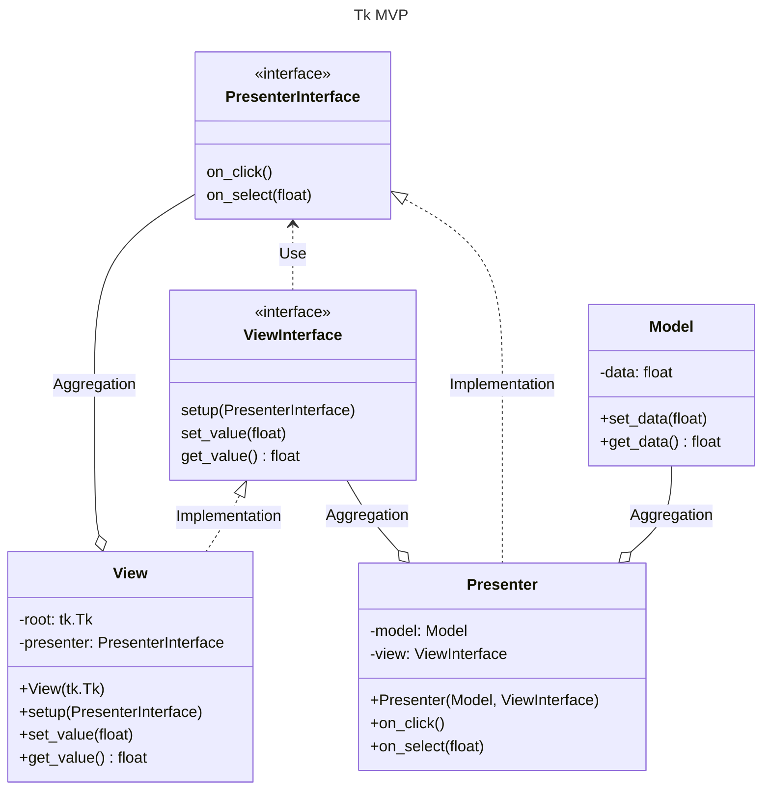

# Python Tkinter MVP

An example of MVP (Model-View-Presenter) pattern implementation with Python [Tkinter](https://docs.python.org/3/library/tkinter.html).

## Usage

```bash
python main.py
```

## UML Class Diagram


